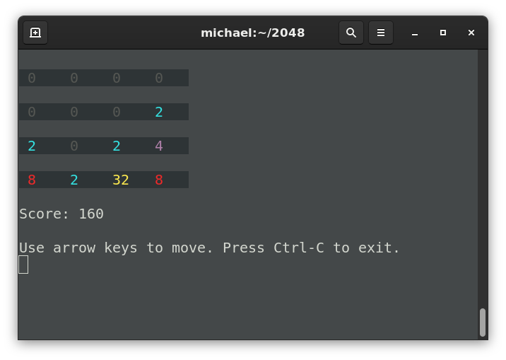

2048
=

A recreation of the game 2048 as a CLI application.

The objective is to combine the numbered tiles on the grid until the tile with the number 2048 is created.
Use your arrow keys to move the tiles. 

